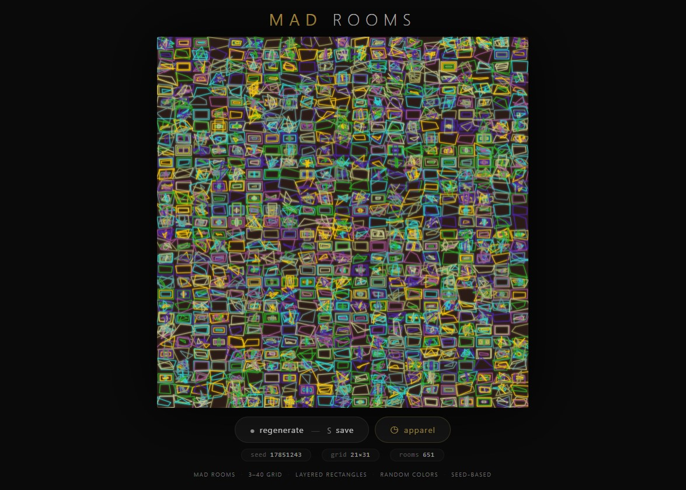
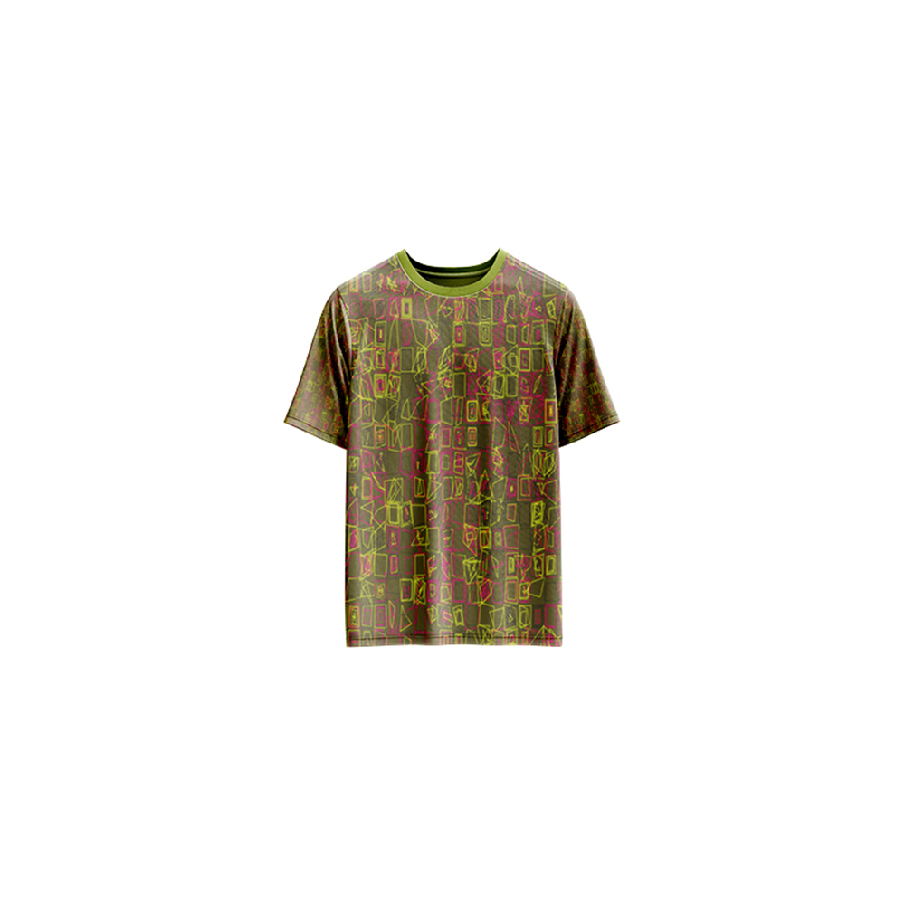

# Mad Rooms — Generative Art

[](https://reyrove.github.io/Mad-Rooms-Generative-Art)
[](https://opensource.org/licenses/MIT)

> **Generative grid room art.** Each refresh creates a unique grid of layered rectangular rooms with random colors, offsets, and intricate patterns.

## 🎨 Live Demo

<div align="center">
  <a href="https://reyrove.github.io/Mad-Rooms-Generative-Art" target="_blank">
    
  </a>
  <br><br>
  <a href="https://reyrove.github.io/Mad-Rooms-Generative-Art" target="_blank">
    
  </a>
  <br>
  <em>Click the image or button to experience the generative art</em>
</div>

## 👕 Apparel Preview

<div align="center">
  
  <br>
  <em>Mad Rooms artwork printed on a T-shirt</em>
</div>

## ✨ Features

- **Grid-Based** — 3×3 to 40×40 grid of rooms
- **Layered Rectangles** — Each room contains 1-10 nested rectangles
- **Rich Color Palettes** — 43 vibrant color combinations
- **Dark Backgrounds** — 27 dark, moody background colors
- **Random Offsets** — Organic, imperfect room shapes
- **Glow Effects** — Soft shadow glow on each rectangle
- **Seed-Based** — Every composition is unique and reproducible via its seed
- **Save & Share** — Download as PNG with seed in filename
- **Apparel Mode** — Preview artwork on a T-shirt mockup
- **Responsive** — Works on desktop, tablet, and mobile
- **Pure JavaScript** — No external dependencies
- **Keyboard Shortcuts**:
  - `R` — Regenerate
  - `S` — Save image
  - `T` — Toggle apparel view

## 🎨 Artwork Details

| Parameter | Range | Description |
|-----------|-------|-------------|
| **Grid Size** | 3×3 to 40×40 | Number of rooms |
| **Layers per Room** | 1–10 | Nested rectangles |
| **Background Colors** | 27 options | Dark, moody colors |
| **Foreground Palettes** | 43 options | Vibrant color combinations |
| **Shadow Blur** | Variable | Soft glow effect |

## 🎯 How It Works

The artwork creates a grid of "rooms" where each room contains nested rectangles:

1. **Setup**:
   - Random dark background color
   - Random grid size (3-40 cells)
   - Random foreground color palette

2. **Room Generation**:
   - Each cell becomes a "room"
   - 1-10 nested rectangles per room
   - Random offsets create organic, imperfect shapes
   - Each rectangle gets a random color from the palette

3. **Rendering**:
   - Dark background
   - Layered rectangles with glow effect
   - Random color selection for each layer

## 🚀 Quick Start

### Local Development

```bash
# Clone the repository
git clone https://github.com/reyrove/Mad-Rooms-Generative-Art.git

# Navigate to the directory
cd Mad-Rooms-Generative-Art

# Open in browser
open index.html
# or use a live server
```

### Deploy to GitHub Pages

1. Push to GitHub
2. Go to Settings → Pages
3. Select branch `main` and root folder
4. Your site will be live at `https://reyrove.github.io/Mad-Rooms-Generative-Art`

## 🧠 How It Works

The artwork is generated using a deterministic random number generator, seeded by timestamp + random noise. Every refresh:

1. **Setup**:
   - Random dark background from 27 colors
   - Random foreground palette from 43 options
   - Random grid size (3-40 cells)

2. **Room Generation**:
   - Each cell in the grid becomes a room
   - Each room has 1-10 nested rectangles
   - Rectangles shrink inward with random offsets
   - Each rectangle gets a random color from the palette

3. **Rendering**:
   - Dark background
   - Glow effect on each rectangle
   - Organic, imperfect shapes from random offsets

## 📁 File Structure

```
Mad-Rooms-Generative-Art/
├── index.html          # Main application (all-in-one)
├── Mad-Rooms.jpg       # T-shirt mockup image
├── fav.svg             # Favicon
├── demo-screenshot.jpg # Website demo screenshot
├── README.md           # This file
└── LICENSE             # MIT License
```

## 🛠️ Tech Stack

- **Pure Vanilla HTML/CSS/JS** — No dependencies
- **Canvas API** — 2D rendering
- **CSS Flexbox/Grid** — Responsive layout
- **GitHub Pages** — Hosting

## 🎯 Interactive Controls

| Action | Keyboard | Button |
|--------|----------|--------|
| Regenerate | `R` | Click "regenerate" |
| Save Image | `S` | Click "regenerate" |
| Toggle Apparel | `T` | Click "apparel" |

## 🎨 The Creative Process

### Grid of Rooms
The canvas is divided into a grid where each cell represents a "room." The grid size varies randomly, creating either dense, intricate patterns or sparse, elegant compositions.

### Layered Rectangles
Each room contains 1-10 nested rectangles that shrink inward. Random offsets create organic, imperfect shapes, making each room feel unique and hand-drawn.

### Color Palettes
43 carefully curated color palettes provide vibrant, harmonious color combinations. Each rectangle in a room gets a random color from the palette, creating rich, varied textures.

### Glow Effect
A soft shadow blur on each rectangle adds depth and dimension, making the rooms feel like they're glowing from within.

## 📱 Responsive Design

The application automatically adapts to:
- Desktop screens
- Tablets
- Mobile phones
- Landscape orientation
- Various aspect ratios

## 🤝 Contributing

Contributions are welcome! Feel free to:
- Fork the repository
- Create a feature branch
- Submit a pull request

### Ideas for Contributions:
- New color palettes
- Additional room shapes
- Animation features
- Interactive controls
- Performance optimizations

## 📄 License

MIT License — see [LICENSE](LICENSE) file for details.

## 🙏 Acknowledgments

- Inspired by architectural plans and room layouts
- Pure JavaScript implementation
- Special thanks to the creative coding community

---

**Built with ❤️ and mad rooms**